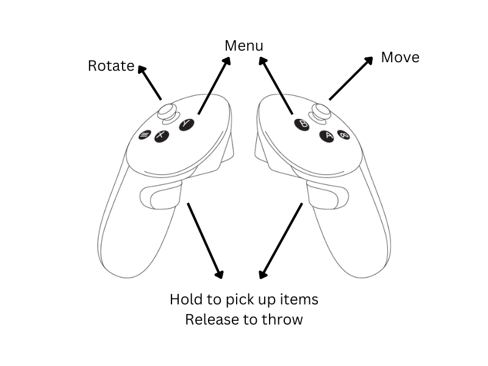

# BeSAFE v2 - Habitat 3.0 on Meta Quest3 via Unreal Engine

Authors: Haonan Chen, Shenghao Zhang, Tianhao Chen, Yingzhe Liu

## Introduction

In this project, we aim to address the limitations of synthetic environments, which often lack realism for robot training. Leveraging Habitat 3.0’s features, particularly its capability to navigate through an environment with a Meta Quest 3 headset, we utilize Unreal Engine’s stunning visual rendering to create a more immersive and realistic simulation.

## Project Setup

Our project is composed of two parts, client and server.

### Server

The server is based on Habitat 3.0. Please refer to [Habitat Pick Throw VR Task](https://github.com/facebookresearch/habitat-lab/tree/main/examples/hitl/pick_throw_vr) for details. Clone the [Habitat Lab](https://github.com/facebookresearch/habitat-lab/) repository and setup according to the instructions. Use the following command to start the server.

```shell
HABITAT_SIM_LOG=warning MAGNUM_LOG=warning \
python examples/hitl/pick_throw_vr/pick_throw_vr.py \
habitat_hitl.networking.enable=True
```

### Client

The client side is a Unreal Engine project based on OculusVR's engine version. To run the project, build the Unreal Engine from [OculusVR-UnrealEngine](https://github.com/Oculus-VR/UnrealEngine). Follow the instructions of OculusVR to setup Unreal Engine and the Android package environment correctly. Then, you can follow the following steps to deploy the application in your Oculus Meta Quest 3.

1. Double click the `BeSAFEUnrealClient.uproject` file to open the project.
2. Change the server IP address in the `BP_BeSAFECharacter` character settings.
3. Select the package platform to be `Android` and deploy the application to the connected Meta Quest 3.

Make sure the server is started when starting the client application.

### Instructions on how to play the application



You can control the characters to move around, approach items, pick them up and throw them as far as you can. Please refer to the image above for detailed input instructions.

When you moving around, you can notice the robot's response based on specific tasks. We integrated two tasks, including social navigation and random pickup.
- Social navigation: you will notice the robot will try to follow you as soon as it finds you in the scene.
- Random pickup: The robot will randomly pick up the items in the scene and relocate it.